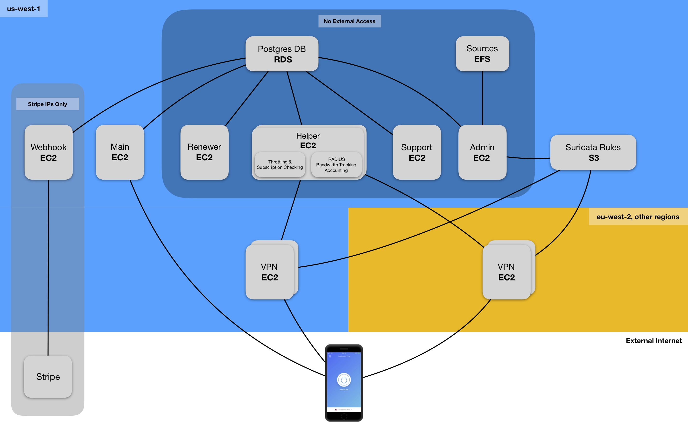

# Confirmed - Openly Operated VPN

- [Confirmed - Openly Operated VPN](#confirmed---openly-operated-vpn)
  * [What is Confirmed VPN?](#what-is-confirmed-vpn-)
  * [How is Confirmed different other VPNs?](#how-is-confirmed-different-other-vpns-)
  * [What does "Openly Operated" mean?](#what-does--openly-operated--mean-)
- [Server Architecture](#server-architecture)
  * [Infrastructure Bringup (CloudFormation)](#infrastructure-bringup--cloudformation-)
  * [Bringing Up An Environment](#bringing-up-an-environment)
  * [Postgres Database](#postgres-database)
    + [Tables](#tables)
      - [certificates](#certificates)
      - [users](#users)
      - [subscriptions](#subscriptions)
      - [admin\_users & support\_users](#admin--users---support--users)
    + [Security & Access](#security---access)
  * [Redis Store](#redis-store)
    + [Security](#security)
    + [Management](#management)
    + [Keys](#keys)
  * [Servers](#servers)
    + [Admin](#admin)
    + [Support](#support)
    + [Helper](#helper)
    + [Renewer](#renewer)
    + [Webhook](#webhook)
    + [VPN](#vpn)
  * [Shared Code](#shared-code)
  * [Code Deployment](#code-deployment)
 
## What is Confirmed VPN?
Confirmed VPN is the first VPN that is both open source and "Openly Operated”, which means that customers can see and confirm exactly what code they’re using, both on the client side and server side.

## How is Confirmed different other VPNs?
Privacy is the most crucial element of a VPN -- it’s the whole reason anyone uses a VPN. With other VPNs, you can’t see the code that the client or server is running on, so you have no way of knowing if they are simply logging everything you browse and selling it to a third party (see [Onavo VPN](http://allthingsd.com/20131015/facebooks-120-million-onavo-buy-comes-with-lots-of-upside/), [Hotspot Shield](https://www.cyberscoop.com/hotspot-shield-accused-of-snooping-on-vpn-users-and-selling-data-to-advertisers/)), or if some intern at the VPN is reading your browsing history, or even if the VPN is properly configured to actually protect your privacy.

With other VPNs, you’re simply shifting your privacy concerns from your ISP to the VPN company -- in the best case. Sure, they could have copy pasted a nice Privacy Policy, but there’s no way to see if they’re actually abiding by it.

## What does "Openly Operated" mean?
Confirmed VPN runs on AWS, and uses a service called Amazon CloudTrail, which is an auditing tool that logs administrative, development, and other actions taken by any and all company employees. CloudTrail logs are tamper-proof and their integrity can be validated using checksum by anyone -- even deleted logs can be detected. These CloudTrail logs are saved to a public S3 bucket (with a 1 week delay).

The result is that customers can actually confirm the exact Git commit that their code is running on, because they can see tamper-proof logs which show the Git commit being deployed to the exact server they’re connected to. Customers can also confirm that we aren’t logging and/or selling their data, that we have the VPN keys properly configured and secured, and that we can’t access their personal information, even if we wanted to.

The access table below summarizes the permissions of each party in Confirmed VPN’s openly operated setup.

 _ | Operator | Auditors | Customers | Public
--- | --- | --- | --- | ---
Server Code |  Yes |  Yes |  Yes  |  Yes
Server Config |  Yes |  Yes |  +1 Week |  +1 Week
Client Code |  Yes |  Yes |  Yes  |  Yes 
Customer's Data |  No |  No |  Yes  |  No 

# Server Architecture

## Infrastructure Bringup (CloudFormation)
Confirmed use AWS CloudFormation to automate bringup of all backend services. CloudFormation allows entire backend infrastructures/environments to be defined and deployed in YAML files. This allows us to quickly bring up and take down entire environments (mostly) automatically and in a few commands.

The following is a diagram of Confirmed VPN's server architecture. Descriptions of each component will follow.



## Bringing Up An Environment


## Postgres Database
The Postgres database stores Users, Certificates, Subscriptions, Admin Users, and Support Users.

### Tables

#### certificates
This table stores client certificates, which are sent to clients on Main `/get-key`. These certificates allow the client to authenticate with and use the VPNs.

Name | Type | Description
--- | --- | ---
`serial` | `text` | Serial of the certificate.
`source_id` | `text` | The Source ID that this certificate belongs to.
`user_id` | `text` | The User ID associated with this certificate.
`revoked` | `boolean` | Whether or not this certificate has been revoked. If evidence is found of this certificate being abusive, this is set to `true` and the user is throttled heavily.
`assigned` | `boolean` | Whether or not this certificate has been assigned. When a new user is created and confirmed, it is assigned a certificate and this value changes from `false` to `true`.
`p12_encrypted` | `text` | The client certificate AES encrypted with `AES_P12_KEY`. This is decrypted and sent to user on Main `POST /get-key`.

#### users

These are consumers/users. A user is created by either IAP receipt or email/password. A user cannot sign in using email until their email is confirmed.

The users table has both `email` and `email_encrypted` columns because `email` allows fast checking of whether or not an email exists in the database (frequently done), and `email_encrypted` allows slow actual retrieval of the email (rarely done). The email is not stored in plaintext as an added layer of security.

Name | Type | Description
--- | --- | ---
`id` | `text` | User ID
`email` | `text` | SHA512 hash of user email with `EMAIL_SALT`.
`email_encrypted` | `text` | AES encrypted user email with `AES_EMAIL_KEY`.
`password` | `text` | BCrypted user password.
`stripe_id` | `text` | Stripe ID of the user.
`email_confirmed` | `boolean` | Whether or not the email is confirmed.
`email_confirm_code` | `text` | Code to confirm an email.
`change_email` | `text` | Hash of email to change to.
`password_reset_code` | `text` | Code to reset password.
`month_usage_megabytes` | `integer` | Monthly usage in megabytes.
`month_usage_update` | `timestamp` | Last time monthly usage was updated.

#### subscriptions

Each row is a subscription. Subscriptions can be of `receipt_type` `ios`, `android`, or `stripe`. Subscriptions are updated by Main in various APIs (`/signin`, `/subscription-event`, etc), but also updated by Renewer when `expiration_date` is coming up.

Name | Type | Description
--- | --- | ---
`user_id` | `text` | User ID
`receipt_id` | `text` | iOS, Android, or Stripe receipt ID
`receipt_type` | `receipt_type` | Can be `ios`, `android`, or `stripe`
`plan_type` | `plan_type` | Can be `ios-monthly`, `ios-annual`, `all-monthly`, `all-annual`, `android-monthly`, or `android-annual`
`expiration_date` | `timestamp` | Time that user's subscription expires
`cancellation_date` | `timestamp` | Time that user's subscription is cancelled
`receipt_data` | `text` | Receipt data encrypted with `AES_RECEIPT_KEY`
`in_trial` | `boolean` | Whether or not subscription is in trial (unreliable flag sometimes)
`failed_last_check` | `boolean` | Whether or not last Renewer update check for this entry failed.
`renew_enabled` | `boolean` | Whether or not subscription's renewal is enabled (unreliable flag sometimes)
`updated` | `timestamp` | Time this subscription was last updated, either through Main API (like `/subscription-event`) or Renewer

#### admin\_users & support\_users

These are super slimmed down versions of `users`. These track Admin and Support users. Email is kept in plaintext.

Name | Type | Description
--- | --- | ---
`email` | `text` | Plaintext email.
`password` | `text` | BCrypted user password.
`email_confirmed` | `boolean` | Whether or not the email is confirmed.
`email_confirm_code` | `text` | Code to confirm an email.
`password_reset_code` | `text` | Code to reset password.

### Security & Access
The Postgres database is accessible by all Confirmed servers except VPN. Security Groups prevent external direct access to the database.

Each server type (Main, Renewer, Helper, etc) can only use a specific database `ROLE` with the bare minimum permissions scoped to only what the server type needs. For example, `renewer` can do `SELECT` and `UPDATE` on the `subscriptions` table, but has no access at all to the `users` table.

Specific grants are copied from `schema.sql` below.

```
CREATE USER main WITH ENCRYPTED PASSWORD '{{ main_password }}';
GRANT SELECT, UPDATE(assigned) ON certificates TO main;
GRANT SELECT, INSERT, UPDATE ON subscriptions TO main;
GRANT SELECT, INSERT, UPDATE ON users TO main;

CREATE USER helper WITH ENCRYPTED PASSWORD '{{ helper_password }}';
GRANT SELECT(user_id, cancellation_date, expiration_date) ON subscriptions TO helper;
GRANT SELECT(source_id, user_id, revoked, assigned) ON certificates TO helper;
GRANT SELECT(id, month_usage_megabytes, month_usage_update), UPDATE(month_usage_megabytes, month_usage_update) ON users TO helper;

CREATE USER renewer WITH ENCRYPTED PASSWORD '{{ renewer_password }}';
GRANT SELECT, UPDATE ON subscriptions TO renewer;

CREATE USER support WITH ENCRYPTED PASSWORD '{{ support_password }}';
GRANT SELECT(id, email, email_encrypted, stripe_id, email_confirmed) ON users TO support;
GRANT SELECT ON subscriptions TO support;
GRANT SELECT, UPDATE, INSERT ON support_users TO support;

CREATE USER webhook WITH ENCRYPTED PASSWORD '{{ webhook_password }}';
GRANT SELECT(id, email, email_encrypted, stripe_id, email_confirmed) ON users TO webhook;
GRANT SELECT(user_id, receipt_type, plan_type, expiration_date, cancellation_date, in_trial, failed_last_check, renew_enabled, updated) ON subscriptions TO webhook;

CREATE USER debug WITH ENCRYPTED PASSWORD '{{ debug_password }}';
GRANT SELECT ON admin_users TO debug;
GRANT SELECT(serial, source_id, user_id, revoked, assigned) ON certificates TO debug;
GRANT SELECT(user_id, receipt_type, plan_type, expiration_date, cancellation_date, in_trial, failed_last_check, renew_enabled, updated) ON subscriptions TO debug;
GRANT SELECT ON support_users TO debug;
GRANT SELECT(id, email_confirmed, month_usage_megabytes, month_usage_update) ON users TO debug;
```

## Redis Store

The Redis store is used for Brute Force Tracking, User Sessions, and Admin/Support User Sessions.

### Security

Redis on AWS is hosted in a private VPC not accessible by the internet. All Confirmed servers access Redis with encrypted transit (TLS) and a Redis AUTH secret stored in `REDIS_PASSWORD`. Encryption at rest is enabled.

### Management

Brute Force restrictions can be looked up and cleared in the Admin Dashboard.

### Keys

Prefix | Description
--- | ---
`a:` | Admin User Sessions
`u:` | User Sessions
`erl:` | Brute Force Tracking
`s:` | Support User Sessions

## Servers

Servers consist of Admin, Support, Helper, Renewer, Webhook, and VPN. Documentation is available for each of these server types in their respective repository, with the exception of VPN, which uses the `Bandwidth` repository. The Shared repository contains shared models and utilities used by all repositories except `Bandwidth`.

## Feedback
If you have any questions, concerns, or other feedback, please let us know any feedback in Github issues or by e-mail.

We also have a bug bounty program that can be found here: https://hackerone.com/confirmed_inc

## License

This project is licensed under the GPL License - see the [LICENSE.md](LICENSE.md) file for details

Our thanks to Algo and @trailofbits for creating Algo, one of the inspirations for our project: https://github.com/trailofbits/algo

# Contact

<engineering@confirmedvpn.com>